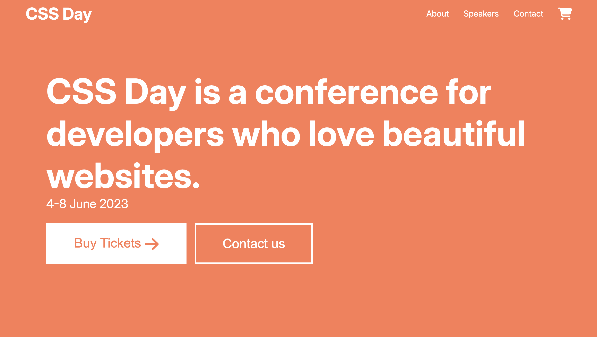
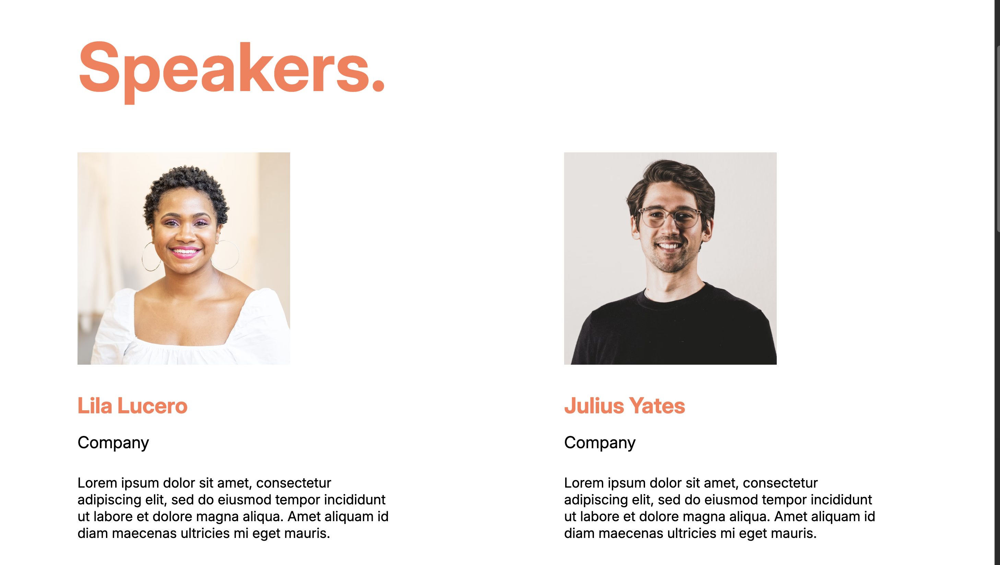

# CSS Day

Minimalist and responsive website, designed to represent a conference like CSS Day. The website includes key sections such as:

-   Event Overview: A brief description of the conference
-   Speakers: Profiles of notable speakers

Tech Stack:

-   HTML
-   CSS

Output:

